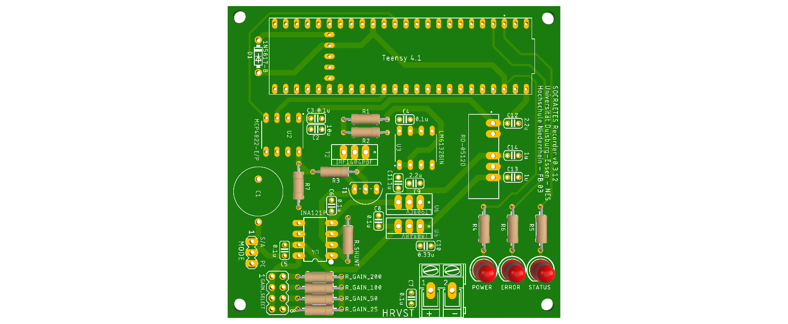
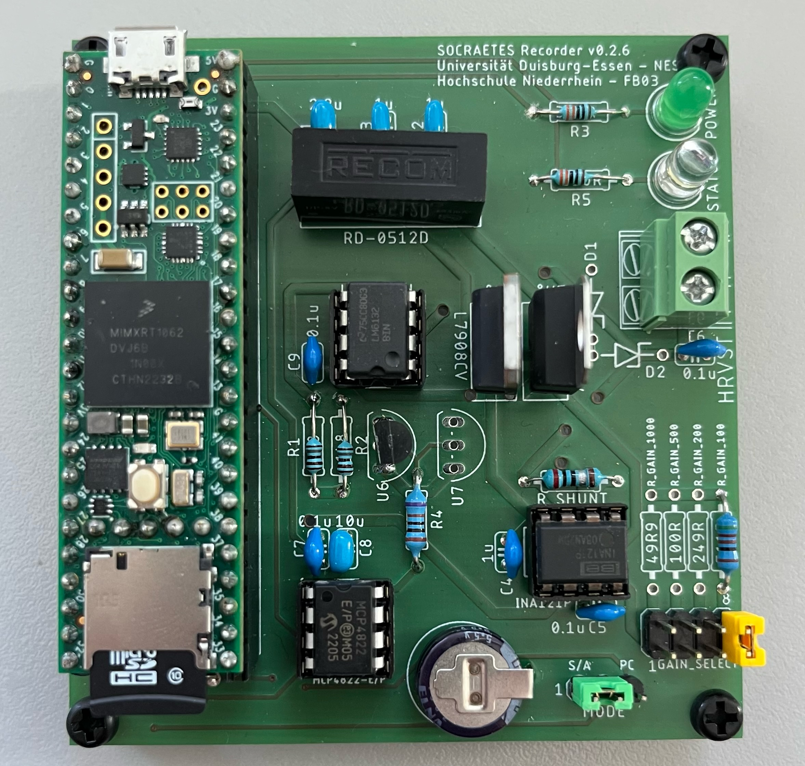
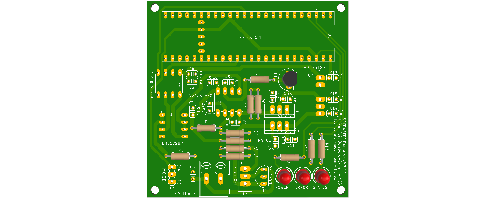
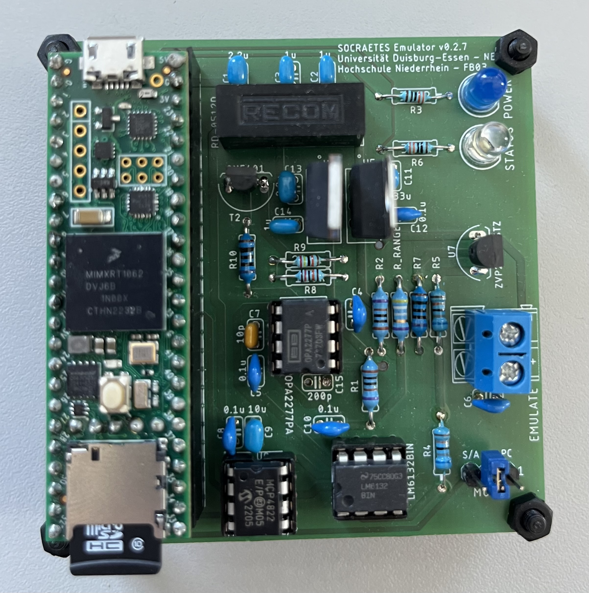

Hardware
=====================================================

This document provides instructions for replicating the hardware of SOCRAETES.
As far as the hardware is concerned, there are 2 options for the users:

#. Using either a solderless breadboard or prototyping board (perfboard)

#. Using the SOCRAETES PCB

The SOCRAETES hardware could be implemented on a solderless breadboard, but this
is highly unrecommended, since the parasitic capacitance and inductance imposed
by a solderless breadboard will very likely interfere with the measurements and
the trace emulation. This will, in turn, reduce the overall accuracy and reliability
of the hardware. However, the SOCRAETES hardware can be implemented quite reliably
on a so-called *Perfboard*. In comparison to a solderless breadboard, a
perfboard will not only provide superior mechanical support to the components,
but also lower parasitic effects that could hinder the accuracy of the hardware.

Aside from the options mentioned above, the SOCRAETES hardware can also be
implemented on the dedicated PCB found in the hardware directory. This method will
yield the highest reliability and accuracy of the hardware, and therefore, is
the recommended method of replicating the hardware.

Regardless of the method chosen for implementing the SOCRAETES hardware, since
all of the components are available in through-hole packages, the soldering of
the hardware should not be a great challenge, even for the users with little
prior experience in electronics and soldering.

Recorder
----------

A 3D-rendering of the circuit board of the current recorder looks like this:

A build example of a minor older version(v. 0.2.6), so that you can imagine 
the setup with teensyboard, could look like this:

Emulator
----------

A 3D-rendering of the circuit board of the current emulator looks like this:

A build example of a minor older version(v. 0.2.7), so that you can imagine 
the setup with teensyboard, could look like this:

